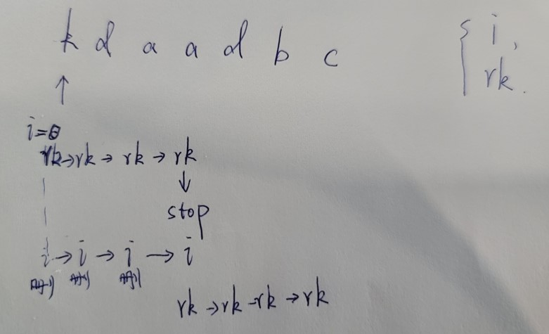
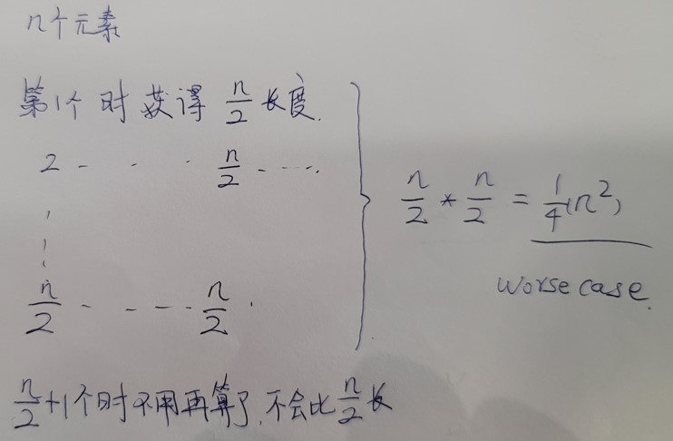

本问题内容参考自:力扣3号题目<无重复字符的最长子串>

### 题目描述
给定一个字符串s, 请你找出其中不含有重复字符的 最长子串的长度.

示例 1:

输入: s = "abcabcbb"
输出: 3 
解释: 因为无重复字符的最长子串是 "abc"，所以其长度为 3。
示例 2:

输入: s = "bbbbb"
输出: 1
解释: 因为无重复字符的最长子串是 "b"，所以其长度为 1。
示例 3:

输入: s = "pwwkew"
输出: 3
解释: 因为无重复字符的最长子串是 "wke"，所以其长度为 3。
     请注意，你的答案必须是 子串 的长度，"pwke" 是一个子序列，不是子串。


提示：

0 <= s.length <= 5 * 104
s 由英文字母、数字、符号和空格组成

### 前置知识
unordered_set template可以被用于检查某个元素是否出现过或存在， 在做查找操作时复杂度为O(1).

### 解题思路
#### 思路一

```c
    //LeeCode上的答案, 复杂度为O(N)
    int static longestUniqueSubstr_1 ( std::string s )
    {
      unordered_set<char> occ;
      int n = s.size();
      int rk = -1, ans = 0;
      for ( int i = 0; i < n; ++i )
      {                                                             //对给定的字符串从头到尾逐个字符遍历

        if ( i != 0 )
        {
          occ.erase ( s[i - 1] );                                  //抹除i的前一个元素
        }

        while ( rk + 1 < n && !occ.count ( s[rk + 1] ) )           //如果当前元素的下一个不是最后一个,并且
                                                                   //当前元素的下一个元素没有出现过
        {
          occ.insert ( s[rk + 1] );                                //把当前元素纳入已有元素的列表
          ++rk;                                                    //判断下一个
        }                                                          //出循环的时候就是有重复元素的时候,
                                                                   //注意这个时候rk停住了,会一直删除最靠前的元素直到rk指向的元素没有重复的为止
                                                                   //(i一直加,erase一直删除,直到occ里面没有重复元素了)

        ans = max ( ans, rk - i + 1 );                             //rk-i+1为当前包含不重复字符的字符串长度

      }
      return ans;
    }
```
Worse Case是什么时候？i和rk总共遍历N次
#### 思路二
```c
    //GeekbyGeek上的答案, 暴力求解，复杂度为O(n^2)
    int static longestUniqueSubstr_2 ( string& s )
    {
      int n = s.size();
      int res = 0;

      for ( int i = 0; i < n; i++ )                               //遍历每一个元素，计算以第i个元素作为起始时能获得的最大长度
      {

        vector<bool> visited ( 256, false );                     //默认最多存储256个元素，char字符最大值256

        for ( int j = i; j < n; j++ )                            //对当前元素后面的所有元素逐个判断，目标获取最长长度
        {

          if ( visited[s[j]] == true )                          //如果当前元素已经有了，直接跳出，说明以第i个元素为起始的最大长度判断完了
            break;
          else                                                  //如果当前元素没有出现过
          {
            res = max ( res, j - i + 1 );                       //更新长度最大值
            visited[s[j]] = true;                               //将当前元素标记为已经存在
          }                                                     //这样就算出了以第i个元素为起始时最长的长度
        }
      }
      return res;
    }
```
Worse Case是什么时候？

所以说可以加一段程序：如果当前res长度比剩余所有元素还要多时就不用继续循环了
#### 思路三
```c
//GeekbyGeek上的答案二，复杂度为O(n^2)
int static longestUniqueSubstr_3 ( string& s )
{
  int maxLength = 0;
  vector<bool>visited ( 256, false );

  int left = 0, right = 0;

  while ( right < s.length() )
  {
    while ( visited[s[right]] == true )                        //如果当前右侧位置元素已经存在，则一直向右移动左侧元素，直到将当前位置元素移出
    {
      visited[s[left]] = false;                                //因为移动了右侧标记，所以需要将当前位置标记为不存在
      left++;                                                  //移动左侧标记，直到将当前与右侧位置重复的左侧元素移出
    }
    visited[s[right]] = true;                                  //右侧标记过的元素，标记为已读

    maxLength = max ( maxLength, ( right - left + 1 ) );
    right++;

  }
  return maxLength;
}
```
#### 思路四
```c
    //GeekbyGeek上的答案一，复杂度为O(1)
    int static longestUniqueSubstr_5 ( string& s )
    {
      if ( s.length() == 0 )
        return 0;
      if ( s.length() == 1 )
        return 1;
      int left = 0;
      int right = 0;
      int maxLen = 0;
      vector<int> lastIndex ( 256, -1 );                      //lastIndex表示各个字符在s中最后出现的位置
                                                              //如果是-1表示当前字符没有出现过
      while ( right < s.length() )
      {
        left = max ( left, lastIndex[s[right]] + 1 );         //如果出现过则只能取当前位置的下一个，或者是left更往后的一个

        maxLen = max ( maxLen, right - left + 1 );            //更新最大长度
        lastIndex[s[right]] = right;                          //更新当前s中对应元素出现的位置
        right++;                                              //开始判断下一个
      }
      return maxLen;
    }
```