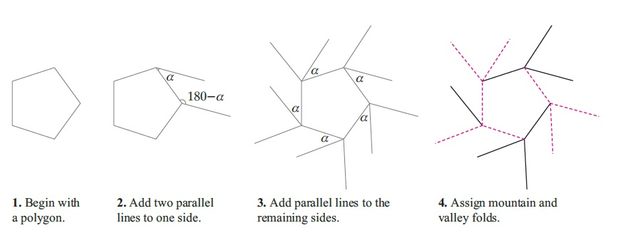

本问内容来自《Twists,tilings, and tessellations - mathematical methods for geometric origami>
一些简写:

SFTs:simple flag twists
BLBA:
cyclic twists: 没有直接的翻译,中心为正多边形,并且正n边形每条边都是峰线或谷线. 这时基本型有一个独特的性质:旋转360/n度后与原图形相同.

## 建立一个折叠镶嵌图案的最简单的方法:
**Step 1** 画出任意一个凸多边形作为镶嵌图案的基本型.
**Step 2** 选择一个任意的角度，这个角度将是整个镶嵌图案中每个基本型的旋转角度.
**Step 3** 对于Step 1中选择的凸多边形的任意一条边,以两个端点为顶点画两条平行的直线,使得一条边与凸多边形边的夹角为a,则另一条平行线与凸多边形边的夹角为180-a.

**Step 4** 对这个凸多边形的所有边都重复Step 3 的操作.
**Step 5** 按照Maekawa-Justin定理将凸多边形及周围平行线分配成峰线与谷线.

***这时镶嵌图案的基本型便设计完成，在一张之上布满上面设计的基本型，分布时需要注意：***
**1.** 对于基本型每条折痕峰线谷线的分配方案并不唯一,也就意味着在符合Maekawa-Justin定理的同时有多种分配方案,每种分配方案对应不同的基本型.
**2.** 纸上除了凸多边形及每个顶点延伸出的平行线外不应有任何其他的折线.
**3.** 纸上相邻两个凸多边形各个顶点延申出的平行线如果是相同类型的峰线或谷线则可以重合.
**4.** 基本型之间的距离没有要求，可大可小.
***通过上面的方法可以快速设计一个镶嵌折纸的图案,但是为什么?***
**问题 1.** 中间图形可以是任意多边形吗?对多边形的边数与角度有没有什么要求?
**问题 2.** 每条边延申出的平行线为什么需要角度相同?对这个相同的角度有没有什么额外的要求?

#### 衍生问题一： 基本型由正凸多边形组成时，平行线与凸多边形边的最大夹角是多少？
***对第二个问题的解答可以从分析简化组成基本型的凸多边形开始,即假设正中间的凸多边形是一个正多边形.
在正多边形为基本型时，平行线与多边形边夹角的值与多边形边的数量和峰谷线的分配有关***
下图是以正六边形作为凸多边形的三种基本型，每种基本型的旋转角度不同.

从上图中从左到右的变化可以看出,若平行线与边的夹角最大值为a,则对于正n边形a为(360/n).

#### 衍生问题二： 凸多边形的相对旋转角度是多少？
***另外,若平行线与边的夹角为a,则凸多边形相对于平面旋转的角度为2a***
可以观察下面图形的线k为例:

凸多边形的边k在绿色平面上旋转了2a,所以凸多边作为一个形整体相对于绿色平面旋转了角度2a.

#### 衍生问题三： 折痕具有怎样的特性时，在互换峰谷线并经过一些简单变换（整体平移，旋转，放大等）后能与原折痕聚合成相同图形？