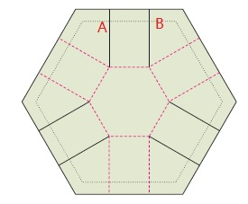
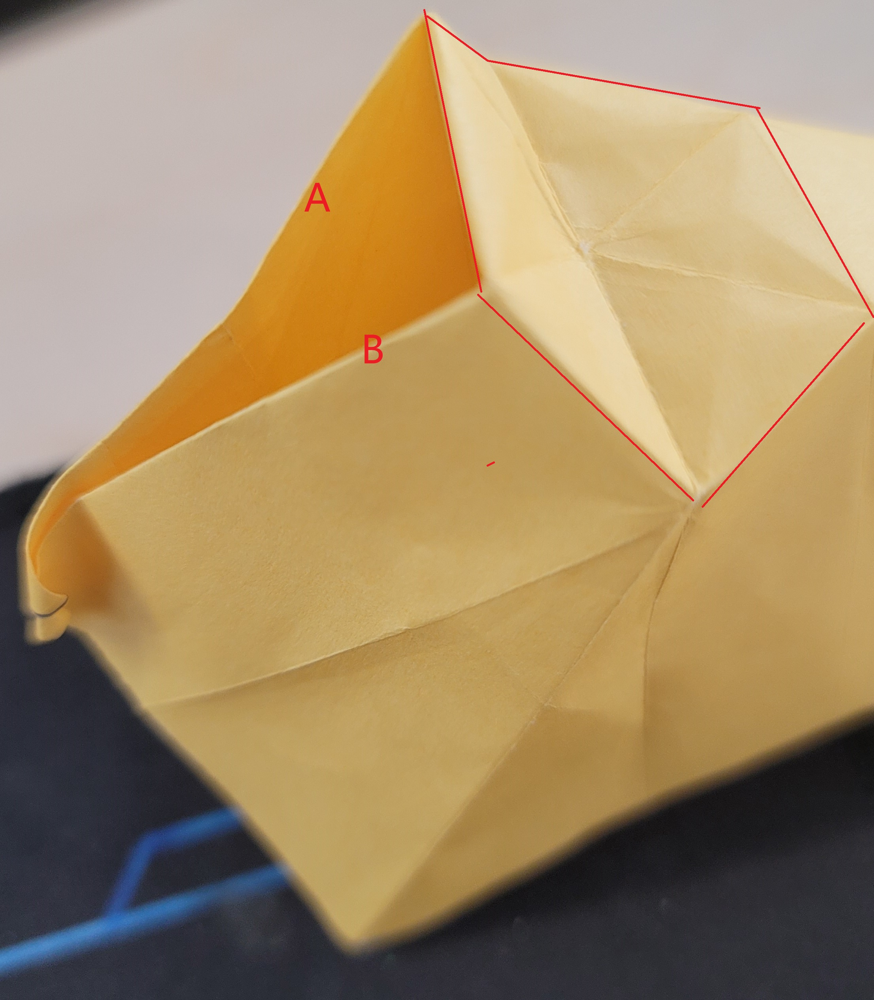

本问内容来自《Twists,tilings, and tessellations - mathematical methods for geometric origami>
一些简写:

SFTs:simple flag twists
BLBA:
cyclic twists: 没有直接的翻译,中心为正多边形,并且正n边形每条边都是峰线或谷线. 这时基本型有一个独特的性质:旋转360/n度后与原图形相同.
anto sector: 一个扇形角度,夹住这个扇形角度的两条线的峰谷特性相反
iso sector: 一个扇形角度,家住这个扇形角度的两条线的峰谷特性相同

## 建立一个折叠镶嵌图案的最简单的方法:
**Step 1** 画出任意一个凸多边形作为镶嵌图案的基本型.
**Step 2** 选择一个任意的角度，这个角度将是整个镶嵌图案中每个基本型的旋转角度.
**Step 3** 对于Step 1中选择的凸多边形的任意一条边,以两个端点为顶点画两条平行的直线,使得一条边与凸多边形边的夹角为a,则另一条平行线与凸多边形边的夹角为180-a.

**Step 4** 对这个凸多边形的所有边都重复Step 3 的操作.
**Step 5** 按照Maekawa-Justin定理将凸多边形及周围平行线分配成峰线与谷线.

***这时镶嵌图案的基本型便设计完成，在一张之上布满上面设计的基本型，分布时需要注意：***
**1.** 对于基本型每条折痕峰线谷线的分配方案并不唯一,也就意味着在符合Maekawa-Justin定理的同时有多种分配方案,每种分配方案对应不同的基本型.
**2.** 纸上除了凸多边形及每个顶点延伸出的平行线外不应有任何其他的折线.
**3.** 纸上相邻两个凸多边形各个顶点延申出的平行线如果是相同类型的峰线或谷线则可以重合.
**4.** 基本型之间的距离没有要求，可大可小.
***通过上面的方法可以快速设计一个镶嵌折纸的图案,但是为什么?***
**问题 1.** 中间图形可以是任意多边形吗?对多边形的边数与角度有没有什么要求?
**问题 2.** 每条边延申出的平行线为什么需要角度相同?对这个相同的角度有没有什么额外的要求?

#### 衍生问题一： 基本型由正凸多边形组成时，平行线与凸多边形边的最大夹角是多少？
***对第二个问题的解答可以从分析简化组成基本型的凸多边形开始,即假设正中间的凸多边形是一个正多边形.
在正多边形为基本型时，平行线与多边形边夹角的值与多边形边的数量和峰谷线的分配有关***
下图是以正六边形作为凸多边形的三种基本型，每种基本型的旋转角度不同.

从上图中从左到右的变化可以看出,若平行线与边的夹角最大值为a,则对于正n边形a为(360/n).

#### 衍生问题二： 凸多边形的相对旋转角度是多少？
***另外,若平行线与边的夹角为a,则凸多边形相对于平面旋转的角度为2a***
可以观察下面图形的线k为例:

凸多边形的边k在绿色平面上旋转了2a,所以凸多边作为一个形整体相对于绿色平面旋转了角度2a.

#### 衍生问题三： 折痕具有怎样的特性时，在互换峰谷线并经过一些简单变换（整体平移，旋转，放大等）后能与原折痕聚合成相同图形？
**Point 1.** 在说明这个问题之前有一点需要明确,对于一个以正凸多边形为基本组成的基本型,如果同时改变两条相邻的平行线与它们的夹边时,这个基本型的所有边与角度仍然是符合Maekawa-Justin定理.
**Point 2.** 这意味着经过这种改变的多边形仍然是可折叠的.下面这个图就是对这种情况的说明.

另外一个需要明确的点是原始的凸多边形各边全为峰或谷的基本型是符合问题要求的多边形.
***所以以原始凸多边形为基础,如果再做出一些Point 1的改变后是有可能得到的基本型是仍然符合问题要求的多边形.***
于是便引出下面4~12边凸多边形具有**问题三**性质的变换总结

这里注意右上角的数字表示相应底下元素的重复次数，比如(MV)^2^表示一个凸多边形各边的折痕为峰谷峰谷,M^2^V^2^表示一个凸多边形各边的折痕为峰峰谷谷.
上表中列出了对于4~12边正多边形为基本型的凸多边形时,如果想满足**衍生问题三**的要求时各边的峰谷情况组合一共有多少种.

#### 衍生问题四: 什么样的镶嵌基本型是可折叠成平面的?
当然, 对于任何一个可折叠成平面的折痕都需要满足下面四个基本条件:
1. 所有节点满足Kawasaki-Justin定理
2. 四条线组成的节点其中其中的三条是峰谷线的一种而剩余的线是另一种
3. 最小角是一个anto sector,最大角是一个iso sector
4. 满足Justion的不交叠条件
但是对于满足这四个基本条件的基本型并不是都能折叠成一个平面, 比如下面这种基本型:

**例子一：**

下图是折叠之后的图形，A和B两条边分别对应上面这张图中A和B两条边，从下图中可以看出，如果A和B两条折痕过长的话，在折叠后会有多余的重合，但是这种情况在截短两边之后便不会发生.
通过这个例子可以说明是否可以折叠成平面与纸的尺寸相关，也可以理解成和折痕间的比例长度相关.

**例子二：**

